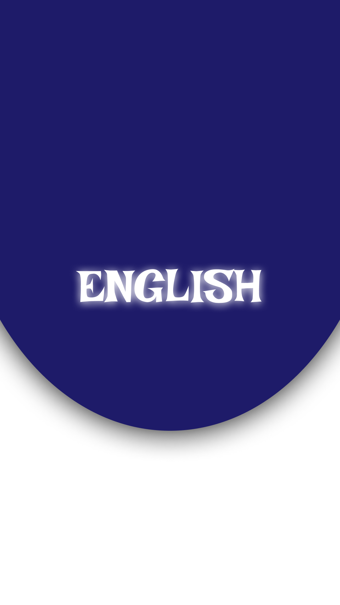
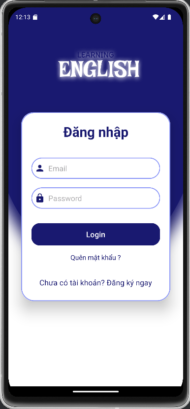
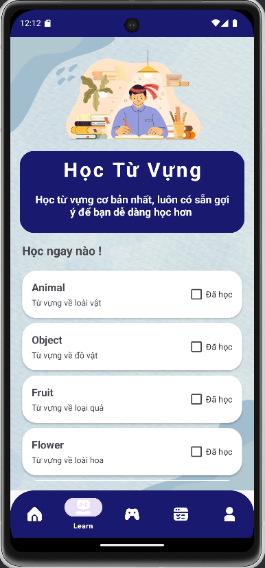
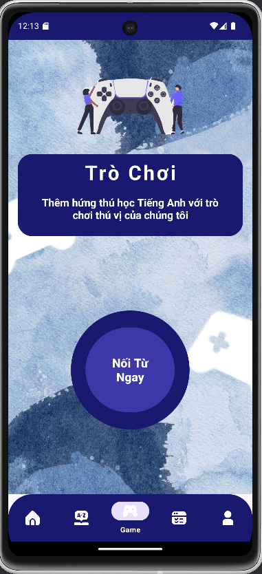
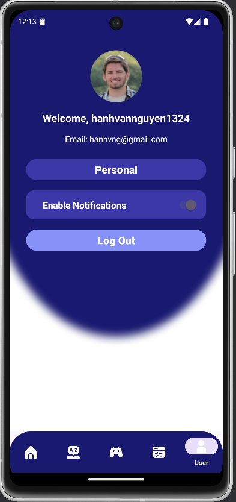

---

# 📘 Dự án Học Tiếng Anh  

Đây là ứng dụng học tiếng Anh được phát triển trong khuôn khổ môn học **Phát triển ứng dụng điện thoại di động**.  
Ứng dụng hướng đến việc hỗ trợ người dùng học từ vựng, ngữ pháp, theo dõi tiến độ học tập, và giải trí với các trò chơi thú vị.  

---

## 🌟 **Tính năng chính**  
- **Học từ vựng**: Ghi nhớ từ vựng qua các danh sách từ được thiết kế sẵn.  
- **Học ngữ pháp**: Hệ thống bài học giúp cải thiện ngữ pháp tiếng Anh cơ bản đến nâng cao.  
- **Kiểm tra tiến độ**: Theo dõi mức độ học tập qua bài kiểm tra định kỳ.  
- **Quiz vui nhộn**: Củng cố kiến thức bằng các bài quiz với giao diện thân thiện.  
- **Giải trí**: Bao gồm các trò chơi nhỏ giúp người dùng vừa học vừa chơi.  

---

## 🚀 **Cách cài đặt**  
1. Tải ứng dụng từ kho lưu trữ này hoặc từ Google Play Store (nếu đã xuất bản).  
2. Cài đặt file APK trên thiết bị Android.  
3. Mở ứng dụng và bắt đầu hành trình học tiếng Anh của bạn!  

---

## 🖼 **Hình ảnh giao diện**

### **Màn hình khởi động**  

  
     

  

### **Logo ứng dụng**  

  
     

  

### **Các giao diện chính**  

  
     
     
     
     
     

  

---

## 📖 **Hướng dẫn sử dụng**  
1. **Đăng nhập/Đăng ký**: Người dùng cần tạo tài khoản hoặc đăng nhập để bắt đầu.  
2. **Chọn chức năng**: Trên màn hình chính, bạn có thể chọn các mục như học từ vựng, ngữ pháp, kiểm tra tiến độ, hoặc chơi trò chơi.  
3. **Cập nhật hồ sơ**: Hồ sơ người dùng sẽ lưu lại lịch sử và tiến độ học tập.  

---

## 📬 **Liên hệ**  
- **Tác giả**: [Tên bạn]  
- **Email**: [Email liên hệ]  
- **GitHub**: [Liên kết GitHub của bạn]  
- **Trường học**: [Tên trường đại học của bạn]  

---

